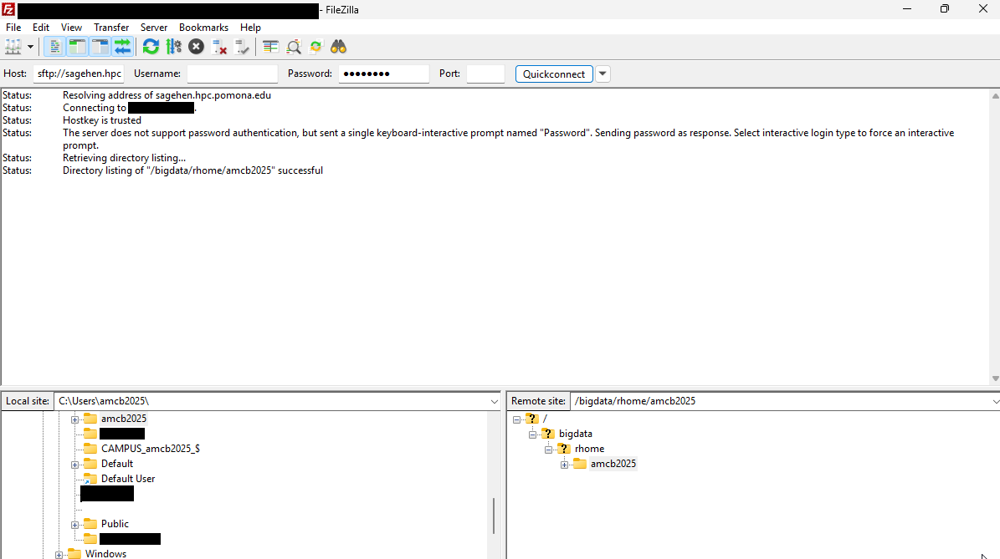

:::::::::::::::::::::::::::::::::::::: questions

- How do I transfer files using FileZilla's drag-and-drop interface?
- How do I monitor transfer progress?
- How do I manage files on Sagehen through FileZilla?

::::::::::::::::::::::::::::::::::::::::::::::::::

::::::::::::::::::::::::::::::::::::: objectives

After completing this episode, participants will be able to:
- Transfer files using drag-and-drop
- Upload and download directories
- Monitor transfer progress and speed
- Manage remote files (rename, delete, create directories)

::::::::::::::::::::::::::::::::::::::::::::::::::

## Navigating Filesystems

The left panel shows your local computer; the right panel shows Sagehen. Double-click folders to enter them, or type a path directly in the path field.

{alt='The FileZilla client connected to sagehen.hpc.pomona.edu over SFTP. The status log confirms the hostkey is trusted and the remote directory listing succeeded. The window is split into a local Windows file tree on the left and the remote Sagehen directory tree on the right.'}

To access lab storage, type `/bigdata/lab/<labname>` in the remote path field and press Enter.

## Uploading Files

**Drag and drop**: Locate a file in the local panel (left), drag it to the remote panel (right), and release. The transfer begins immediately.

**Right-click menu**: Right-click a file in the local panel and select **Upload**.

**Multiple files**: Hold Ctrl (or Cmd on Mac) and click to select multiple files, then drag them all to the remote panel. FileZilla queues and transfers them in sequence.

**Directories**: Right-click a directory in the local panel and select Upload. FileZilla uploads the directory and all its contents, preserving the folder structure.

## Downloading Files

Drag files from the remote panel (right) to the local panel (left), or right-click a remote file and select **Download**.

## Transfer Monitoring

The bottom panel shows active and queued transfers with real-time speed and progress:

```
Speed: 12.3 MB/s
Time remaining: 2 minutes 15 seconds
Data transferred: 100 MB / 250 MB (40%)
```

Typical speeds: 1-5 MB/s (slower connection), 5-20 MB/s (good), 20+ MB/s (fast).

### Pausing and Resuming

Right-click an active transfer to Pause. Right-click a paused transfer to Resume from the same position.

## File Management

- **Create directory**: Right-click in remote panel > Create directory
- **Rename**: Right-click file > Rename
- **Delete**: Right-click file > Delete (permanent, use with caution)

## Verifying Transfers

After upload, compare file sizes between local and remote:

```bash
# On local machine
ls -lh myfile.dat

# On Sagehen (via SSH)
ls -lh /rhome/<myusername>/myfile.dat
```

::::::::::::::::::::::::::::::::::::: callout

## Compress Before Transferring

Save transfer time by compressing files first:

```bash
tar czf myproject.tar.gz myproject/
```

Compression typically reduces text/CSV data 5-20x. Then transfer the compressed file and decompress on Sagehen with `tar xzf myproject.tar.gz`.

::::::::::::::::::::::::::::::::::::::::::::::::::

## Troubleshooting

- **Transfer hangs**: Wait, then try Pause/Resume. For very large files, use rsync instead
- **Files not appearing**: Press F5 to refresh the remote view
- **Connection refused**: Verify hostname is `sagehen.hpc.pomona.edu` port 22
- **Authentication failed**: Verify Pomona credentials, check for Duo notification

::::::::::::::::::::::::::::::::::::: challenge

## Challenge: Round-Trip Transfer

1. Navigate the local panel to a file on your computer (1-100 MB)
2. In the remote panel, create a directory: `filezilla_test`
3. Upload the file to `filezilla_test/`
4. Note the transfer speed from the progress panel
5. Download the file back and verify the size matches

::::::::::::::::::::::::::::::::::::: solution

Expected result: the file appears in `/rhome/<myusername>/filezilla_test/` with matching size. Transfer speed depends on your network -- typical range is 5-15 MB/s. The downloaded copy should be identical to the original.

::::::::::::::::::::::::::::::::::::::::::::::::::

::::::::::::::::::::::::::::::::::::::::::::::::::

::::::::::::::::::::::::::::::::::::: keypoints

- Drag-and-drop makes FileZilla transfers intuitive for uploads and downloads
- The transfer queue shows real-time progress, speed, and estimated time
- Compress files before transfer to reduce time significantly
- Good for interactive transfers up to several hundred MB; use rsync for larger files

::::::::::::::::::::::::::::::::::::::::::::::::::

<!-- highlight <labname>/<myusername> placeholders in code blocks; remove if the varnish theme handles this natively -->
<script>(function(){var CSS='.sh-placeholder{color:#c2410c;font-weight:700}[data-bs-theme="dark"] .sh-placeholder,html.dark .sh-placeholder{color:#fdba74}@media (prefers-color-scheme: dark){[data-bs-theme="auto"] .sh-placeholder{color:#fdba74}}';var RX=/<labname>|<myusername>/g;function firstMatch(el){var w=document.createTreeWalker(el,NodeFilter.SHOW_TEXT,null),nodes=[],full='';while(w.nextNode()){nodes.push({n:w.currentNode,s:full.length});full+=w.currentNode.nodeValue;}RX.lastIndex=0;var m;while((m=RX.exec(full))){var s=m.index,e=s+m[0].length,inSpan=false,parts=[];for(var j=0;j<nodes.length;j++){var ns=nodes[j].s,ne=ns+nodes[j].n.nodeValue.length;if(ne<=s||ns>=e)continue;parts.push({node:nodes[j].n,a:Math.max(s-ns,0),b:Math.min(e-ns,nodes[j].n.nodeValue.length)});var p=nodes[j].n.parentNode;while(p&&p!==el){if(p.classList&&p.classList.contains('sh-placeholder')){inSpan=true;break;}p=p.parentNode;}}if(!inSpan&&parts.length)return parts;}return null;}function wrapParts(parts){for(var i=parts.length-1;i>=0;i--){var t=parts[i].node,txt=t.nodeValue,a=parts[i].a,b=parts[i].b;var span=document.createElement('span');span.className='sh-placeholder';span.textContent=txt.slice(a,b);var f=document.createDocumentFragment();if(a>0)f.appendChild(document.createTextNode(txt.slice(0,a)));f.appendChild(span);if(b<txt.length)f.appendChild(document.createTextNode(txt.slice(b)));t.parentNode.replaceChild(f,t);}}function run(){var st=document.createElement('style');st.textContent=CSS;document.head.appendChild(st);document.querySelectorAll('pre,code').forEach(function(el){var guard=0,parts;while((parts=firstMatch(el))&&guard++<500){wrapParts(parts);}});}if(document.readyState==='loading'){document.addEventListener('DOMContentLoaded',run);}else{run();}})();</script>
