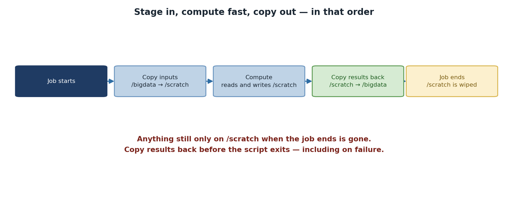

:::::::::::::::::::::::::::::::::::::: questions

- Why should I use temporary storage during jobs?
- How do I access `/scratch` in my job scripts?
- How do I safely copy data in and out of scratch?
- What are the failure modes that lose results, and how do I prevent them?

::::::::::::::::::::::::::::::::::::::::::::::::::

::::::::::::::::::::::::::::::::::::: objectives

After completing this episode, participants will be able to:
- Explain the performance benefits of scratch storage
- Access scratch storage using SLURM environment variables
- Implement the copy-in, compute, copy-out pattern
- Avoid losing results by copying back before the job ends
- Diagnose I/O bottlenecks that scratch can fix

::::::::::::::::::::::::::::::::::::::::::::::::::

## Why Use Scratch?

Scratch storage provides significant performance advantages because the data lives on local NVMe SSDs inside the compute node, not on the cluster's shared NFS mounts:

```
/rhome or /bigdata:  ~20-50 MB/s   (network filesystem, contended)
/scratch:            ~100-300 MB/s  (local SSD, dedicated to your job)
```

For a job reading 10 GB of data, this means completing in 30-50 seconds on scratch versus 200+ seconds on `/rhome`: a **4-7x speedup**. For machine learning, simulation, and any pipeline that re-reads the same files thousands of times during training, the cumulative savings are even larger.

The performance gap matters most when many jobs are reading from `/bigdata` simultaneously. BeeGFS spreads data across several storage servers, but that bandwidth is still shared between everyone using the filesystem. If five jobs on five different nodes are all reading from `/bigdata/lab/<labname>/` at once, each gets a fraction of the available bandwidth. `/scratch` is local: each job has the full disk to itself.

{alt='A five-step flow through a job. The job starts, inputs are copied from /bigdata to /scratch, computation reads and writes /scratch, results are copied back from /scratch to /bigdata, and then the job ends and /scratch is wiped. A warning states that anything still only on /scratch when the job ends is gone, so results must be copied back before the script exits, including on failure.'}

::::::::::::::::::::::::::::::::::::: callout
## Scratch Is Non-Persistent

Data on `/scratch` is **deleted when your job completes**. Always copy results back to `/rhome` or `/bigdata` before the job ends. If you forget, your results are permanently lost.

There is no "but I had it five minutes ago" recovery. The cleanup is immediate when SLURM marks the job complete. Build the copy-out step into every script that uses scratch, and verify it before requesting time on a long run.

::::::::::::::::::::::::::::::::::::::::::::::::::

## Accessing Scratch in Job Scripts

SLURM provides environment variables for constructing scratch paths:

```bash
$SLURM_JOB_USER    # Your username
$SLURM_JOB_ID      # Unique job ID number
```

**Full scratch path:** `/scratch/$SLURM_JOB_USER/$SLURM_JOB_ID`

This per-job directory naming matters. If you used `/scratch/alice/work/` and submitted ten jobs at once, they would all write to the same directory and trash each other's intermediate files. The `$SLURM_JOB_ID` keeps each job's workspace isolated.

## The Standard Pattern: Copy-In, Compute, Copy-Out

```bash
#!/bin/bash
#SBATCH --job-name=process_data
#SBATCH --time=04:00:00
#SBATCH --mem=32G

# Set up paths
SCRATCH_DIR=/scratch/$SLURM_JOB_USER/$SLURM_JOB_ID
mkdir -p $SCRATCH_DIR

echo "=== Stage 1: Copy input data to scratch ==="
rsync -avhP /rhome/<myusername>/input/*.dat $SCRATCH_DIR/

echo "=== Stage 2: Run computation ==="
cd $SCRATCH_DIR
./myanalysis *.dat

echo "=== Stage 3: Copy results back ==="
rsync -avhP $SCRATCH_DIR/output*.h5 /rhome/<myusername>/results/

echo "=== Job complete ==="
```

The pattern has three deliberate stages and each carries a lesson. Stage 1 stages all input data so subsequent reads hit local SSD instead of the network. Stage 2 does the work in scratch where I/O is fast. Stage 3 copies results back to persistent storage *before* the SLURM job ends, ensuring nothing is lost when scratch is cleaned.

`rsync -avhP` is preferred over `cp` because it shows progress, preserves attributes, and is restartable if it gets interrupted. The `-h` makes sizes human-readable and `-P` shows progress and supports partial transfers.

## Checking Available Space

Before copying large datasets, verify space is available:

```bash
SCRATCH_DIR=/scratch/$SLURM_JOB_USER/$SLURM_JOB_ID
mkdir -p $SCRATCH_DIR

AVAIL_SPACE=$(df $SCRATCH_DIR | tail -1 | awk '{print $4}')
NEEDED_SPACE=$((5 * 1024 * 1024))  # 5 GB in KB

if [ $AVAIL_SPACE -lt $NEEDED_SPACE ]; then
    echo "ERROR: Not enough space on scratch"
    exit 1
fi
```

This is most useful for jobs that copy a few hundred GB of data. For smaller jobs, the check is overkill. The key idea: failing fast at job start is much cheaper than failing four hours into a run because scratch filled up halfway through.

## Multi-Stage Pipelines

Chain multiple processing stages on scratch to avoid round-tripping through NFS:

```bash
#!/bin/bash
#SBATCH --job-name=pipeline
#SBATCH --time=08:00:00

SCRATCH_DIR=/scratch/$SLURM_JOB_USER/$SLURM_JOB_ID
mkdir -p $SCRATCH_DIR
cd $SCRATCH_DIR

rsync -avhP /rhome/<myusername>/raw_data/ $SCRATCH_DIR/input/
./preprocess input/ -o preprocessed/
./analyze preprocessed/ -o analysis/

# Copy all results back
rsync -avhP analysis/ /rhome/<myusername>/results/analysis/
```

The intermediate `preprocessed/` directory never leaves scratch. It does not need to: the next stage reads it locally. This pattern is the single biggest performance win you can get from rewriting a multi-stage pipeline on HPC.

## Real-World Example: Machine Learning

```bash
#!/bin/bash
#SBATCH --job-name=train_model
#SBATCH --time=04:00:00
#SBATCH --gpus=1
#SBATCH --mem=32G

SCRATCH=/scratch/$SLURM_JOB_USER/$SLURM_JOB_ID
mkdir -p $SCRATCH

rsync -avhP /rhome/<myusername>/training_data.h5 $SCRATCH/
cd $SCRATCH
python train.py --data training_data.h5 --output model.pkl

# Save results to permanent storage
rsync -avhP model.pkl /rhome/<myusername>/results/
```

For ML training in particular, scratch is essentially mandatory. PyTorch DataLoaders with `num_workers > 0` issue many parallel reads, and NFS handles parallel reads from one client poorly. Reading from local SSD avoids GPU starvation entirely.

::::::::::::::::::::::::::::::::::::: callout

## Failure modes that silently lose results

The two failure modes that bite people, in order of frequency:

The script's compute step fails, the copy-out step is skipped (because of `set -e` or just script flow), and scratch gets cleaned. Mitigation: always run the copy-out unconditionally. Use a trap or an `if` block, but make sure it executes even on failure.

The job hits its time limit during the compute step. SLURM kills it; copy-out never runs. Mitigation: budget extra time for copy-out, and consider a `signal` directive that gives your script a few minutes' warning before the timeout.

```bash
#SBATCH --signal=B:USR1@300   # send USR1 5 minutes before timeout

trap 'rsync -avhP results/ /rhome/$USER/results/; exit' USR1
```

::::::::::::::::::::::::::::::::::::::::::::::::::

::::::::::::::::::::::::::::::::::::: challenge

## Challenge: Scratch Performance Test

Create two job scripts: one writing to `/rhome` and one to `/scratch`:

**Without scratch:**
```bash
#!/bin/bash
#SBATCH --job-name=no_scratch
#SBATCH --time=00:05:00

cd /rhome/<myusername>
time dd if=/dev/zero of=test_1gb.dat bs=1M count=1024
rm test_1gb.dat
```

**With scratch:**
```bash
#!/bin/bash
#SBATCH --job-name=with_scratch
#SBATCH --time=00:05:00

SCRATCH=/scratch/$SLURM_JOB_USER/$SLURM_JOB_ID
mkdir -p $SCRATCH
cd $SCRATCH
time dd if=/dev/zero of=test_1gb.dat bs=1M count=1024
```

Compare the "real" time from each. How much faster was scratch?

::::::::::::::::::::::::::::::::::::: solution

Typical results:
```
Without scratch: real 0m12.456s
With scratch:    real 0m3.821s
Improvement:     3.3x faster
```

For a 4-hour I/O-intensive job, this difference multiplies significantly: 12 minutes saved per GB of throughput, or roughly an hour saved per 5 GB of working set.

The result varies with cluster load: when `/bigdata` is contended by many simultaneous users, the gap can stretch to 10x or more.

::::::::::::::::::::::::::::::::::::::::::::::::::

::::::::::::::::::::::::::::::::::::::::::::::::::

::::::::::::::::::::::::::::::::::::: challenge

## Challenge: Diagnose a Lost Result

A graduate student reports that her 6-hour SLURM job ran successfully (final output line: "Analysis complete"), but the result file `analysis_summary.csv` is nowhere to be found in her home directory. List two likely explanations and how to fix each for next time.

::::::::::::::::::::::::::::::::::::: solution

Explanation 1: the script wrote to `/scratch/$USER/$SLURM_JOB_ID/` but never copied the result back to `/rhome` or `/bigdata`. The file was deleted when SLURM cleaned scratch. Fix: add an `rsync` step at the end of the script. Check the SLURM output file (`slurm-JOBID.out`) for any errors near the end.

Explanation 2: the script wrote to a relative path (`./analysis_summary.csv`) without `cd`-ing first. The file is in whatever directory `sbatch` was invoked from, which may not be where she is looking. Fix: use absolute paths or explicit `cd` at the start.

In both cases, `find /rhome/$USER /bigdata -name "analysis_summary.csv" -mtime -1` will quickly locate any candidate file from the last 24 hours.

::::::::::::::::::::::::::::::::::::::::::::::::::

::::::::::::::::::::::::::::::::::::::::::::::::::

::::::::::::::::::::::::::::::::::::: keypoints

- Scratch (`/scratch/$SLURM_JOB_USER/$SLURM_JOB_ID`) provides 4-7x faster I/O than /rhome
- Scratch is deleted when your job completes; always copy results back unconditionally
- Use the copy-in, compute, copy-out pattern for all I/O-intensive jobs
- Multi-stage pipelines should keep intermediate files on scratch, not round-trip through NFS
- Check available space before copying large datasets to fail fast
- Use a trap with `--signal` to copy results out even if the job hits its time limit
- ML training is essentially mandatory on scratch because of DataLoader parallel reads

::::::::::::::::::::::::::::::::::::::::::::::::::

<!-- highlight <labname>/<myusername> placeholders in code blocks; remove if the varnish theme handles this natively -->
<script>(function(){var CSS='.sh-placeholder{color:#c2410c;font-weight:700}[data-bs-theme="dark"] .sh-placeholder,html.dark .sh-placeholder{color:#fdba74}@media (prefers-color-scheme: dark){[data-bs-theme="auto"] .sh-placeholder{color:#fdba74}}';var RX=/<labname>|<myusername>/g;function firstMatch(el){var w=document.createTreeWalker(el,NodeFilter.SHOW_TEXT,null),nodes=[],full='';while(w.nextNode()){nodes.push({n:w.currentNode,s:full.length});full+=w.currentNode.nodeValue;}RX.lastIndex=0;var m;while((m=RX.exec(full))){var s=m.index,e=s+m[0].length,inSpan=false,parts=[];for(var j=0;j<nodes.length;j++){var ns=nodes[j].s,ne=ns+nodes[j].n.nodeValue.length;if(ne<=s||ns>=e)continue;parts.push({node:nodes[j].n,a:Math.max(s-ns,0),b:Math.min(e-ns,nodes[j].n.nodeValue.length)});var p=nodes[j].n.parentNode;while(p&&p!==el){if(p.classList&&p.classList.contains('sh-placeholder')){inSpan=true;break;}p=p.parentNode;}}if(!inSpan&&parts.length)return parts;}return null;}function wrapParts(parts){for(var i=parts.length-1;i>=0;i--){var t=parts[i].node,txt=t.nodeValue,a=parts[i].a,b=parts[i].b;var span=document.createElement('span');span.className='sh-placeholder';span.textContent=txt.slice(a,b);var f=document.createDocumentFragment();if(a>0)f.appendChild(document.createTextNode(txt.slice(0,a)));f.appendChild(span);if(b<txt.length)f.appendChild(document.createTextNode(txt.slice(b)));t.parentNode.replaceChild(f,t);}}function run(){var st=document.createElement('style');st.textContent=CSS;document.head.appendChild(st);document.querySelectorAll('pre,code').forEach(function(el){var guard=0,parts;while((parts=firstMatch(el))&&guard++<500){wrapParts(parts);}});}if(document.readyState==='loading'){document.addEventListener('DOMContentLoaded',run);}else{run();}})();</script>
